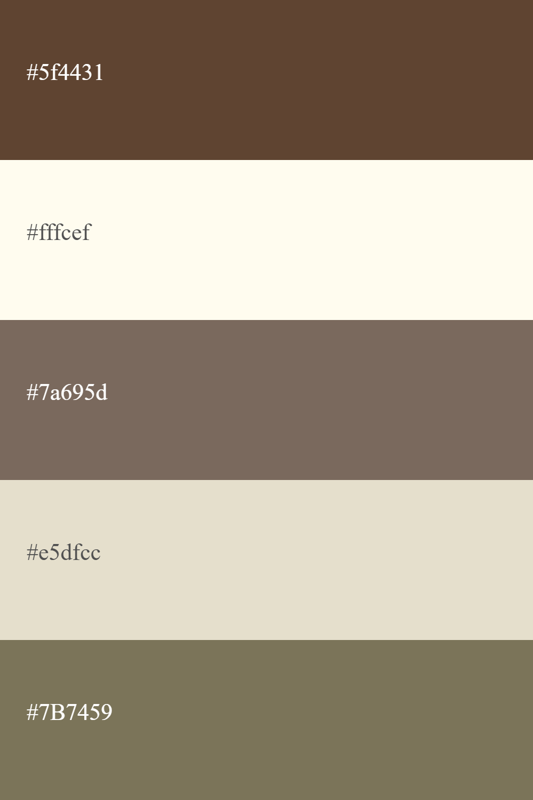

<h1 align="center">PORTIFÓLIO PESSOAL</h1>

<h2>🖥️ Sobre o projeto</h2>

Este projeto web tem como objeivo divulgar, facilitar e melhorar o trabalho.

<h3>Paleta de cores</h3>
 
<h3>Linguagens utilizadas</h3>
  
<h2>🧑‍💻 Autores</h2>
<table>
  <tr>
    <td align="center">
      
       <a href="https://github.com/beaxx"><b>Beatriz Oliveira</b></a>
       <small>Desenvolvedora</small>
    </td>
    <td align="center">
      
       <a href="https://github.com/Gigiovh"><b>Giovanna Clemente</b></a>
       <small>Desenvolvedora</small>
    </td>
    <td align="center">
      
       <a href="https://github.com/neymarsd"><b>Neymar Siqueira</b></a>
       <small>QA</small>
    </td>
  </tr>
</table>
